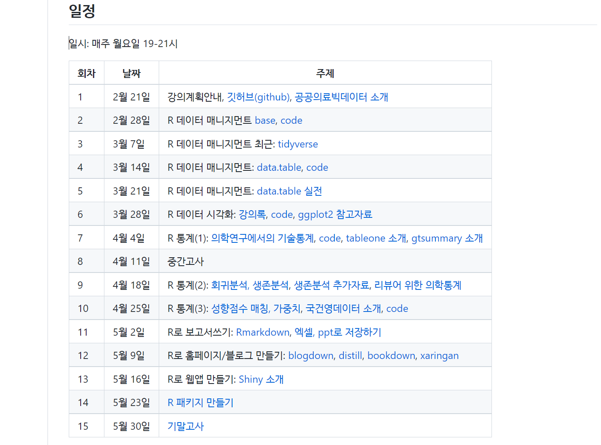

```{r setup, include=FALSE}
options(htmltools.dir.version = FALSE)
knitr::opts_chunk$set(echo = FALSE, fig.align = "center")
library(knitr);library(DT);library(shiny);library(survival);library(survey)
for (v in c("sex", "status")){
  colon[[v]] <- factor(colon[[v]])
}
data(nhanes)
nhanes$HI_CHOL <- factor(nhanes$HI_CHOL)
nhanes$race <- factor(nhanes$race)
nhanes$RIAGENDR <- factor(nhanes$RIAGENDR)

```


layout: true

<div class="my-footer"><span><a href="https://www.zarathu.com">Zarathu Co.,Ltd</a>   
&emsp;&emsp;&emsp;&emsp;&emsp;&emsp;&emsp;&emsp;&emsp;&emsp;&emsp;&emsp;&emsp;
&emsp;&emsp;&emsp;&emsp;&emsp;&emsp;&emsp;&emsp;&emsp;&emsp;&emsp;&emsp;&emsp;
<a href="https://github.com/jinseob2kim">김진섭</a></span></div> 


---
# Executive summary

.large[
분석: **의학 + 연구는 R**추천 
- 데이터 전처리는 **[data.table](https://blog.zarathu.com/posts/2022-02-11-datatable/)** 과 `%>%`.  

- R로 ppt/xlsx 만들기(분석결과 반출)

- 일반, 반복측정, 표본추출, Propensity, meta, 시계열, ML

- 코드관리는 Github

서비스: 리포트(Rmarkdown), 웹 애플리케이션(Shiny) 

서버: 분석환경 or 웹 서비스
- 리눅스, 클라우드, Docker 
]


---
class: center, middle


# 하는일 


---
# 맞춤형 통계웹


---
# [공개 통계웹](https://openstat.ai) 

.large[
- 간단한 통계(table 1, 회귀분석, ROC)는 데이터 직접 업로드 한 후 분석.

- Propensity score analysis, 국건영데이터분석, 메타분석 
]

<center>
</a>
</center>

---
# 프로그램 개발, 블로그 운영

.large[
[R](https://www.r-project.org/) packages

- [jstable](https://github.com/jinseob2kim/jstable): 논문용 테이블 만들기


- [jskm](https://github.com/jinseob2kim/jskm): 생존분석 그림 만들기


- [jsmodule](https://github.com/jinseob2kim/jsmodule): 웹에서 하는 통계분석


개발환경 배포
- [rshiny image](https://github.com/jinseob2kim/docker-rshiny)

블로그: https://blog.zarathu.com

]


---
# 80,000 다운로드

<center>
</a>
</center>


---
# 발표: R패키지 개발 후기
<center>
</a>
</center>

---
# 주요 계약 


- 대한심혈관중재학회 [COBIS III 레지스트리](https://clinicaltrials.gov/ct2/show/NCT03068494) 분석: [추가계약](http://pf.kakao.com/_XsuxgC/48388190)


- 서울성모병원 [COREA-AMI II 레지스트리](https://clinicaltrials.gov/ct2/show/NCT02806102) 분석: [10개 연구 계약](http://pf.kakao.com/_XsuxgC/48043955)


- 삼성서울병원 [공통데이터모델(CDM)](http://www.feedernet.org/html/?pmode=cdmdrn) 분석: [심평원 코로나데이터](https://hira-covid19.net/) 분석 중 


- 강동성심병원 CDM 분석지원: 공단표본데이터 분석 중 


- 경기도감염병관리지원단 코로나 대시보드 with Shinykorea: [최종보고](https://shinykorea.github.io/corona-activityrecord) 


- 삼성서울병원 이식외과 육종(sarcoma) 데이터 분석: [5개 연구 계약](http://pf.kakao.com/_XsuxgC/51701089) 


- 해운대백병원 정신질환 네트워크분석: [논문 5편](http://pf.kakao.com/_XsuxgC/52664370) 게재


- 성균관의대 환경역학연구실 [미세먼지 대시보드](http://pf.kakao.com/_XsuxgC/43627405)


- [삼성서울병원 정신과 통계자문계약](http://pf.kakao.com/_XsuxgC/55192190)

- [서울대병원 순환기내과 통계자문계약](http://pf.kakao.com/_XsuxgC/55577702)

---
# 주요 논문 성과 

.large[
SCI 논문 200건 지원
]
<center>
</a>
</center>


---
# 정부지원사업 선정

<center>
</a>
</center>


---
# 22년 IITP 연구개발과제 선정 

.large[
2년 10.5억 with 앤틀러, 파이디지털헬스케어
]
<center>
</a>
</center>

---
# 22년 창업도약패키지 선정

.large[
1억
]
<center>
</a>
</center>

---
# 규제과학과 3학점 강의

.large[
R 활용 빅데이터분석: 공단/국건영 예제데이터 활용
]

<center>
<a href="https://github.com/jinseob2kim/R-skku-biohrs"></a>
</center>

---

class: center, middle

# 분석


---
# R vs Python

.large[
**의료데이터 + 연구**는 R이 좋다.

- 의학분야 최신패키지는 R first

- 강력한 전처리 패키지 존재: [tidyverse](https://blog.zarathu.com/posts/2020-04-06-rdatamanagementtidyverse/), [data.table](https://blog.zarathu.com/posts/2022-02-11-datatable/)

- 문서, 슬라이드 제작등 컨텐츠 만드는데 최적화. 

- [Rmarkdown](https://blog.zarathu.com/posts/2019-01-03-rmarkdown/): 글, 테이블, 그림, 참고문헌까지 R로만 논문 작성가능. 

- 공통데이터모델(OMOP-CDM) 분석언어
]

--
.large[
**AI 특화**는 Python 추천

- R로도 다 되긴하나(torch, keras), 구글링 Python 유리

- 신경망 외 일반적인 ML은 R로 충분히 좋다([caret](https://github.com/topepo/caret/) 추천)
]

---
# [tidyverse](https://blog.zarathu.com/posts/2020-04-06-rdatamanagementtidyverse/)

.large[
R 기본문법 대체, 사실상 표준문법. 
]

<center>
<a href="https://www.storybench.org/getting-started-with-tidyverse-in-r/"></a>
</center>

<center>
<a href="http://ds4ps.org/dp4ss-textbook/p-072-data-recipes.html"></a>
</center>


---
# [data.table](https://blog.zarathu.com/posts/2022-02-11-datatable/)

.large[
가장 빠른 스피드, 빅데이터용 필수패키지

- 심평원/공단분석 필수.

- 파일 가장 빨리 읽고 쓰는 [fst](https://www.fstpackage.org/)와 찰떡궁합

- 멀티코어 지원

]

<center>
<a href="https://github.com/fastverse/fastverse"></a>
</center>


---
# [R plot](https://blog.zarathu.com/posts/2022-03-25-graph/)

.large[
[ggplot2](https://ggplot2.tidyverse.org/) > Base: 사실상 표준 

- [ggpubr](https://partrita.github.io/posts/ggpubr/) : 연구용 그림 + p-value 최적화

- [highcharter](https://jkunst.com/highcharter/): 반응형 그림, 상업용은 유료

- [jskm](https://github.com/jinseob2kim/jskm): 자체 개발 kaplan-meier 패키지 
]

<center>
<a href="https://github.com/jinseob2kim/jskm"></a>
</center>

---
# PPT export: [officer](https://davidgohel.github.io/officer/)

.large[
그림 직접수정위해 반드시 PPT with 벡터그래픽 필요
]

```{r, eval=F, echo=T}
library(rvg);library(officer)
editable_graph <- dml(ggobj = gg_plot)
doc <- read_pptx()
doc <- add_slide(doc)
doc <- ph_with(x = doc, editable_graph,
   location = ph_location_type(type = "body") )
print(doc, target = "reports/rvg.pptx")
```

<center>
<a href="https://ardata-fr.github.io/officeverse/reports/rvg.pptx"></a>
</center>


---
# 공단/심평원분석 전략 

.large[
공단/심평원은 SAS 파일, 그러나 R로 대부분 가능 

- [haven](https://haven.tidyverse.org) 패키지로 sas7bdat 읽기, but 느림

- csv 또는 fst로 변환하여 R로 빨리 읽기

- SAS는 R서버 RAM보다 큰 데이터 다룰 때만: 크게크게 쳐냄

- 반출 테이블: xlsx 하나에 탭들로 저장, [openxlsx](https://github.com/ycphs/openxlsx) 패키지 이용

- 반출 그림: pptx 하나에 여러 슬라이드로 저장. [officer](https://davidgohel.github.io/officer/)

]


---
# [openxlsx](https://github.com/ycphs/openxlsx)

```r
# create workbook
wb <- createWorkbook()
addWorksheet(wb = wb, sheetName = "htwt")
writeData(wb = wb, sheet = "htwt", x = htwt)

addWorksheet(wb = wb, sheetName = "smk")
writeData(wb = wb, sheet = "smk", x = smk, rowNames=T)

saveWorkbook(wb, "tables.xlsx", overwrite = T) 
```
.large[
[반출 파일 실습](https://github.com/jinseob2kim/R-skku-biohrs/blob/main/lecture/dataexport.pptx?raw=true)
]


---
# CDM(OMOP) with R

.large[
CDM 분석 모든과정은 [R패키지](https://github.com/OHDSI)로 구현됨.
]

<center>
</a>
</center>


---
# 분석코드, 결과도 R패키지

.large[
연구설계, 분석방법이 포함된 자체 R패키지가 코드공유 표준. 

- R패키지를 여러 기관에서 실행
]

https://github.com/zarathucorp/RanitidineCancerRisk

--
.large[
분석결과는 R Shiny로 

- 실행결과를 R기반 웹애플리케이션으로 표현

- 분석코드에 웹코드도 포함되어있음.
]


---

# 통계 

.large[

데이터 형태에 따라 
- 일반, 반복측정, 표본추출, Propensity/IPTW

생존분석: Time-dependent analysis, landmark analysis

메타분석: [meta](https://bookdown.org/MathiasHarrer/Doing_Meta_Analysis_in_R/), [자체 개발앱](https://openstat.ai/app/meta-analysis/)

시계열분석: [fpp3 교과서](https://otexts.com/fpp3/)- ARIMA, [prophet](https://facebook.github.io/prophet/)

ML general: [caret](https://topepo.github.io/caret/index.html)

Non-linear(GAM) model: [mgcv](https://www.maths.ed.ac.uk/~swood34/mgcv/)


]

---
# 분석(X), 결과테이블(O)

```{r, echo=T}
tb <- jstable::CreateTableOneJS(c("sex", "age", "status", "time"), strata = "rx", data = colon, nonnormal = "time")
kable(tb$table[, 1:6])
```

---
# 표본추출(국건영)

```{r, echo=T}
nhanesSvy <- svydesign(ids = ~ SDMVPSU, strata = ~ SDMVSTRA, weights = ~ WTMEC2YR, nest = T, data = nhanes)
tb <- jstable::svyCreateTableOneJS(c("HI_CHOL", "agecat"), strata = "RIAGENDR", data = nhanesSvy)
kable(tb$table[, 1:5])
```

---
# 회귀분석류 table 만들기 

```{r, echo=T}
glm_gaussian <- glm(mpg~cyl + disp, data = mtcars)
jstable::glmshow.display(glm_gaussian, decimal = 2)$table %>% kable

glm_binomial <- glm(vs~cyl + disp, data = mtcars, family = binomial)
jstable::glmshow.display(glm_binomial, decimal = 2)$table %>% kable

```

[더 살펴보기](https://github.com/jinseob2kim/jstable)


---
# Propensity score

.large[

그룹간의 baseline 맞춰주는 방법

- **Matching**: 적당한 사람들을 뽑음, N loss

- **IPTW(Inverse probability treatment weighting)**: 사람마다 가중치를 다르게 줌, N loss 無

- [MatchIt](https://cran.r-project.org/web/packages/MatchIt/vignettes/MatchIt.html): 2그룹 PS matching, IPTW 

- [twang](https://cran.r-project.org/web/packages/twang/index.html) : 3그룹 이상 IPTW
]


---
# [생존분석 심화](https://blog.zarathu.com/posts/2020-10-29-survivalpractice/)


**Time-dependent  coefficients**
- 비례위험가정 깨질 때, Landmark analysis

**Time-dependent covariate**
- 관찰 시작 후 covariate 상태가 바뀔때 (ex: 약물복용) 

예: 피부질환 진단 후(Indexdate) 약물치료 여부에 따른 Outcome
- **Indexdate ~ 약물치료일, 약물치료일 ~ F/U 마지막날** 한 사람의 데이터를 2개로 나눔.

Competing risk analysis: 최신 `survival` 패키지 기본옵션. 

- 심혈관질환 발생할 사람이었는데 죽어서 못본다?

- 심혈관질환: outcome, 사망: competing risk


---
# Landmark analysis

```{r, include=F}
colon$status <- as.integer(as.character(colon$status))
```

```{r, echo=T, out.width="50%"}
fit <- survfit(Surv(time,status)~rx, data=colon)
jskm::jskm(fit, mark = F,  surv.scale = "percent", pval =T, table = T, cut.landmark = 500, showpercent = T)

```


---
# Meta analysis

.large[
[meta](https://github.com/guido-s/meta/) 패키지가 표준
- Forest/Drapery plot, Sub-group analysis

- Random/Fixed effect

- Publication bias: Funnel plot/Trim & fill 
]

[자체 개발앱](https://openstat.ai/app/meta-analysis/)


---
# 시계열

.large[
[fpp3](https://otexts.com/fpp3/) 교과서 추천

- [tsibble](https://tsibble.tidyverts.org/): 시계열 데이터전처리 

- [fable](https://fable.tidyverts.org/): ARIMA 계수 자동추정, 간단한 시계열 인공신경망

- [prophet](https://facebook.github.io/prophet/): Meta 가 개발한 Additive model 기반 패키지 
]

<center>
<a href="https://www.youtube.com/watch?v=6v3_AsbhqrE"></a>
</center>


---
# ETC

.large[
Non-linear(GAM) model
- [mgcv](https://www.maths.ed.ac.uk/~swood34/mgcv/) 패키지가 표준

ML general
- [caret](https://topepo.github.io/caret/index.html)
]


---
# [Github](https://github.com/)

.large[
코딩하는 사람은 무조건 써야함. R보다 더 중요

- 코드 관리, 모든 중간기록 보관

- 오픈소스 SW(예: R패키지) 는 대부분 Github 프로젝트

- 포트폴리오 관리: 사실상의 이력서

- 간단한 홈페이지 운영 가능: 본 슬라이드도 Github 호스팅
]


---

class: center, middle

# 서비스


---
# [R](https://www.r-project.org/)의 확장

.large[
[R](https://www.r-project.org/)은 이제 단순한 통계프로그램이 아님.

* [R Markdown](https://rmarkdown.rstudio.com/): 논문과 발표자료를 [R](https://www.r-project.org/) 에서 직접 만듦. [과거 정리 내용](https://blog.zarathu.com/posts/2019-01-03-rmarkdown/)
]
--

.large[
* [blogdown](https://github.com/rstudio/blogdown): 홈페이지도 만들 수 있음. 당사 홈페이지도 이것과 [distill](https://rstudio.github.io/distill/) 로 제작.
]
--

.large[
* [Shiny](https://shiny.rstudio.com/), [Shiny Server](https://www.rstudio.com/products/shiny/shiny-server/): 서버 구축하고 웹기반 앱을 만들 수 있음. 간단한 Shiny 앱들은 Shinyapps.io 에서 무료호스팅.

]
--

법인 설립 후 모든 작업에 [R](https://www.r-project.org/)을 이용함. 

---
# 논문 

.large[
[R](https://www.r-project.org/)에서 글, 그림, 테이블, 참고문헌까지 직접 작성. 
 
* [rticles](https://github.com/rstudio/rticles): 대부분 학술지의 템플릿을 포함.

```{r, fig.align='center', out.width= "50%"}
include_graphics("https://bookdown.org/yihui/rmarkdown/images/rticles-templates.png")
```

]

[준비하던 박사논문](https://blog.zarathu.com/posts/2018-11-08-mdlm/)  


---
# 발표 슬라이드

.large[
논문쓸 때 이용했던 R 코드 활용, 빠르게 발표 슬라이드 제작 가능.

* [기본 템플릿](https://rmarkdown.rstudio.com/lesson-11.html), [xaringan](https://github.com/yihui/xaringan) 패키지: 이 슬라이드도 [xaringan](https://github.com/yihui/xaringan)으로 제작.

```{r, out.width= "70%"}
include_graphics("https://user-images.githubusercontent.com/163582/53144527-35f7a500-3562-11e9-862e-892d3fd7036d.gif")
```

포스터: [posterdown](https://brentthorne.github.io/posterdown_html_showcase/), [pagedown](https://pagedown.rbind.io/poster-relaxed)
]


---
# 홈페이지

.large[
[blogdown](https://github.com/rstudio/blogdown), [distill](https://rstudio.github.io/distill/): [깃허브](https://pages.github.com/) 통해 무료 웹호스팅 가능.

```{r, out.width= "80%"}
include_graphics("https://www.storybench.org/wp-content/uploads/2019/05/blogdown-new-site-e1557149319624-730x457.png")
```

[홈페이지](https://github.com/zarathucorp/zarathu), [블로그](https://github.com/zarathucorp/blog)
]

---
# 웹 앱

.large[
[Shiny](https://shiny.rstudio.com/): [R](https://www.r-project.org/) 코드만으로 웹앱 제작
]
```{r}
include_graphics("https://shiny.rstudio.com/images/debugging/kmeans-showcase.gif")
```


---

class: center, middle

# Shiny 소개


---

### [Shiny](https://shiny.rstudio.com/) is an R package that makes it easy to **build web applications with R**


```{r, align = "center"}
include_graphics("https://github.com/jinseob2kim/shiny-workshop-odsc2019/raw/master/docs/rs.png")
```

---

# 웹 개발 지식 없어도 됨

```{r, align = "center"}
include_graphics("https://github.com/jinseob2kim/shiny-workshop-odsc2019/raw/master/docs/css.png")
```


---

# Shiny app

```{r, align = "center"}
include_graphics("https://github.com/jinseob2kim/shiny-workshop-odsc2019/raw/master/docs/ui.png")
```

---

# UI & SERVER

```{r, align = "center"}
include_graphics("https://github.com/jinseob2kim/shiny-workshop-odsc2019/raw/master/docs/ui2.png")
```


---

# Make basic App

* `app.R` 파일 만들고(**이름 바뀌면 안됨**)

* `ui` 와 `server` 코드 작성 후 `shinyApp` 으로 마무리. **Run App** 눌러 실행.

  - `ui.R`, `server.R` 따로 작성할 수도 있음. 개인 취향


```{r, align = "center"}
include_graphics("https://github.com/jinseob2kim/shiny-workshop-odsc2019/raw/master/docs/basic.png")
```


---
# 공부모임: Shiny 밋업

.large[
https://github.com/shinykorea/Meetup

- 월 1회 공부내용 공유. 36회 진행 

- 의료/유전학/축산/반도체/게임/IPTV/회계 등 다양한 분야 사람들이 모임. 

- **경기도 코로나 대시보드 공동작업**

- 21년 공개SW기반 **커뮤니티** 지원사업, **韓中日 공개SW** 국제협력 강화 TASK 선정


]


---

class: center, middle

# 서버


---
# 분석환경 

.large[
빅데이터분석은 대부분 리눅스 서버에서
- 공단/심평원 R server

서버 초기세팅(RStudio, 패키지, Shiny 설치) 위한 리눅스 지식(ubuntu or fedora)

]
<center>
<a href="https://affizon.com/ko/fedora-%EB%8C%80-ubuntu-%EC%96%B4%EB%96%A4-linux-%EB%B0%B0%ED%8F%AC%EA%B0%80-%EB%8D%94-%EB%82%AB%EC%8A%B5%EB%8B%88%EA%B9%8C"></a>
</center>

]


---
# 서버 바뀌면?

.large[
서버 바뀔때 마다 새로 세팅?
- R 패키지 설치에만 1시간 이상 걸림(리눅스는 오래걸림)

아예 초기세팅 완료된 가상머신을 만들어놓자. 그러나 Virtual Machine(VM) 은 너무 느림

- [Docker](https://www.docker.com/)는 리눅스기반 컨테이너 서비스.

- [rocker project](https://www.rocker-project.org/): R 관련 Docker image 모음

- RStudio, 패키지, Shiny server 모두 설치된 [rshiny image](https://github.com/jinseob2kim/docker-rshiny) 자체 개발 
]


---
# Docker  

.large[
마이크로서비스 아키텍처란?
]

```{r, out.width= "40%"}
include_graphics("https://blog.philipphauer.de/blog/2015/0411-microservices-nutshell-pros-cons/Monolith-vs-Microservices.png")
```

```{r, out.width= "60%", fig.cap ="https://blog.philipphauer.de/microservices-nutshell-pros-cons/"}
include_graphics("https://blog.philipphauer.de/blog/2015/0411-microservices-nutshell-pros-cons/Scaling-Microservices.png")
```


---
# 여행용 파우치 

```{r,  out.width= "60%", fig.cap = "https://funshop.akamaized.net/products/0000045775/HF-INLUGGAGE-POUCH-LINGERIE-%EC%83%81%EC%84%B8%ED%8E%98%EC%9D%B4%EC%A7%80_01.jpg"}
include_graphics("https://funshop.akamaized.net/products/0000045775/HF-INLUGGAGE-POUCH-LINGERIE-%EC%83%81%EC%84%B8%ED%8E%98%EC%9D%B4%EC%A7%80_01.jpg")
```


---
# 여행용 파우치 장단점

장점

1. **깔끔하다.**

2. 치우기 쉽다. 

3. 다른 가방으로 옮기기 쉽다. 

4. 가방 종류에 구애받지 않는다.


단점

1. 실제 쓸 수 있는 공간이 줄어든다. 

2. 분리해서 넣기 귀찮다. 

3. 물건 찾을 때 지퍼를 한번 더 열어야 된다. 


---
# Microservice 장단점

장점

1. **깔끔하다.**

2. 삭제가 쉽다. 

3. 다른 컴퓨터에 재설치 쉽다.

4. 컴퓨터/서버 종류에 구애받지 않는다. 


단점

1. 실제 쓸 수 있는 용량이 줄어든다. 

2. 서비스마다 모듈 만들기 귀찮다. 

3. 성능저하 우려 


**가상머신(Virtual machine)** 활용이 대표적.  

---
# [Docker](https://www.docker.com/what-docker)

- 빠르고 용량이 적은 가상머신?
- [Docker hub](https://hub.docker.com/)을 통해 [github](https://github.com/)처럼 이용가능.  
    + [github](https://github.com/)과 연계 가능 
    + [github](https://github.com/)에 이미지 제작 코드 저장하면 [Docker hub](https://hub.docker.com/)에 실제 이미지가 저장


```{r, out.width= "60%", fig.cap = "https://doi.org/10.1371/journal.pone.0152686"}
include_graphics("https://journals.plos.org/plosone/article/figure/image?size=large&id=10.1371/journal.pone.0152686.g002")
```


---
# 클라우드

.large[
물리서버 필요없음, 쓴만큼 요금부과 
- AWS, Azure, 네이버, [vultr](https://www.vultr.com/)(한국 region 있으면서 가장저렴)

OMOM-CDM 실습환경이 [AWS](https://github.com/OHDSI/OHDSIonAWS)로 제공됨 

[openstat.ai](https://openstat.ai) 도 클라우드에서 운영

]

<center>
<a href="https://github.com/OHDSI/OHDSIonAWS"></a>
</center>


---
# 발표: 개발환경구축
<center>
<a href="https://blog.zarathu.com/posts/2018-11-08-ruck2018/"></a>
</center>


---
# Executive summary

.large[
분석: **의학 + 연구는 R**추천 
- 데이터 전처리는 **[data.table](https://blog.zarathu.com/posts/2022-02-11-datatable/)** 과 `%>%`.  

- R로 ppt/xlsx 만들기(분석결과 반출)

- 일반, 반복측정, 표본추출, Propensity, meta, 시계열

- 코드관리는 Github

서비스: 리포트(Rmarkdown), 웹 애플리케이션(Shiny) 

서버: 분석환경 or 웹 서비스
- 리눅스, 클라우드, Docker 
]

---
# 철강왕 박태준 우향우정신

.large[
> 선조의 피값(대일 청구권 자금)으로 짓는 포항제철, 실패하면 우향우해서 영일만에 빠져 죽자

]

<center>
</a>
</center>


---
# 醫俠(의협: 의학 + 의로울 협) 정신

.large[
> 환자 희생으로 만들어진 데이터, 실패하면 한강에 빠져 죽자 

- 최선의 결과를 내야하는 의료진, 최선의 결과를 원하는 환자

- But, 최악과 차악뿐인 선택지

- 선택과 사투과정이 담긴 데이터

- 이 데이터를 헛되게 쓰는건, 환자의 희생과 의료진의 노력을 헛되게 만드는 것. 

]


---

class: center, middle

# END
